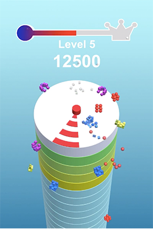
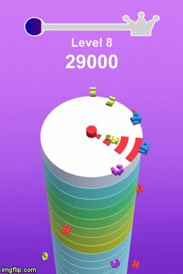
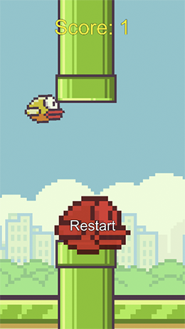

# Unity3D | C# | Portfolio

### ARrobot
`<projectLink>` : [ARrobot](https://github.com/Smi1e-man/ARrobot)
###### Unity3D | AR | Vuforia | AR App | Unity course: Introduction to XR: AR, VR, MR

### 3Touches
`<projectLink>` : [3Touches](https://github.com/Smi1e-man/3Touches)
###### Unity3D | C# | Mobile Game

### KingRock
`<projectLink>` : [KingRock](https://github.com/Smi1e-man/KingRock)
###### Unity3D | C# | Mobile Game

### HyperCasualGameJam2019
`<projectLink>` : [GameJamProject](https://github.com/Smi1e-man/HyperCasualGameJam2019)
###### Unity3D | C# | Team Work | Bronze prize | Mobile Game | [Name]Shell Not Pass

### NewHexagon
`<projectLink>` : [NewHexagon](https://github.com/Smi1e-man/NewHexagon)
###### Unity3D | C# | Mobile Game

### Flights-n-Fuel
`<projectLink>` : [Flights-n-Fuel](https://github.com/Smi1e-man/Flights-n-Fuel)
###### Unity3D | C# | Mobile Game

### FlappyBird
`<projectLink>` : [FlappyBird](https://github.com/Smi1e-man/FlappyBird)
###### Unity3D | C# | Mobile Game Recode

